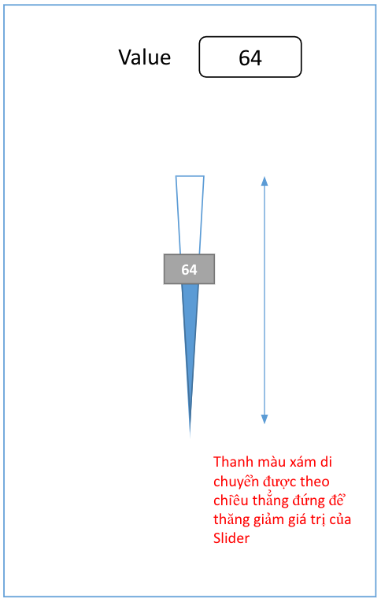
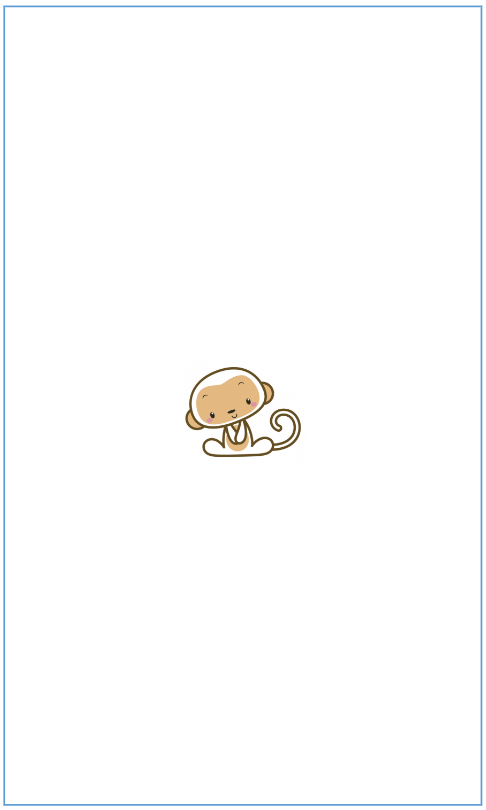
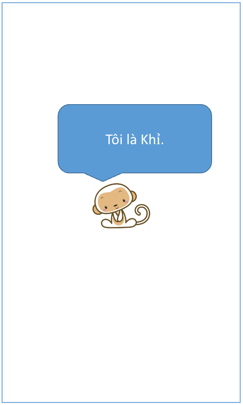

# 004 - Gestures

Với **SwiftUI**, bạn thay đổi tư duy không còn dùng tới các thuộc tính `frame` nữa. Nhưng tất cả không phải vậy. Việc xác định vị trí và thức hiện các hành động cảm ứng vẫn là một trong những yêu cầu quan trong trong phát triển một ứng dụng mobile. Do đo, chủ đề bài tập này sẽ liên quan tới chúng.

> Bắt đầu thôi!

## Chuẩn bị

### Lý thuyết

* GeometryReader
* Basic Gesture
* Gesture state
* Update UI with gesture
* Composing gestures
* Timer

### Môi trường

* Xcode 14
* SwiftUI 4
* Swift 5.7

### Tham khảo 

* [SwiftUI Gestures](https://developer.apple.com/documentation/swiftui/gestures)
* [Adding interactivity with gestures](https://developer.apple.com/documentation/swiftui/adding-interactivity-with-gestures)
* [Composing SwiftUI gestures](https://developer.apple.com/documentation/swiftui/composing-swiftui-gestures)
* [How to use gesture in SwiftUI](https://www.hackingwithswift.com/books/ios-swiftui/how-to-use-gestures-in-swiftui)
* [How to provide relative sizes using GeometryReader](https://www.hackingwithswift.com/quick-start/swiftui/how-to-provide-relative-sizes-using-geometryreader)
* [GeometryReader](https://developer.apple.com/documentation/swiftui/geometryreader)

---

## Bài 1 - Custom Slider

### Yêu cầu

* Tạo mới một project SwiftUI.
* Custom slider như hình vẽ
* Yêu cầu:
	* Tạo class **MySliderView** và *custom* như hình bên cạnh
	* Khi nhập số từ **TextField** thì *slider* tự động di chuyển theo
	* Khi kéo thả *slider* thì:
		* Số hiển thị trên *thumbnail* sẽ thay đổi
		* Trên *Textfield* cũng thao đổi theo
* Sử dụng *State & Binding* để truyền dữ liệu giữa các View

### Mô tả

## Bài 2 - Khỉ (1)

### Yêu cầu

* Bài tập với con khỉ
* Tạo mới một màn hình trong project
* Yêu cầu
	* Dùng 2 ngón tay **zoom** con khỉ to lên hay nhỏ lại. Với: 
		* Tỉ lệ **scale** nhỏ nhất là `0.5`
		* Tỉ lệ **scale** lớn nhất là `2.0`
	* Dùng 2 ngón tay **xoay** con khỉ
	* Dùng 1 ngón tay nhấn giữ con khỉ **5 giây** thì con khỉ quay trở lại trạng thái ban đầu:
		* Tỉ lệ scale 1.0
		* Không xoay

* Kết hợp các yêu cầu vào cùng 1 màn hình để thử việc kết hợp các tương tác cùng một lúc.
* Có thể lựa chọn hình con khỉ khác đẹp hơn nhoé!

### Mô tả

## Bài 3 - Khỉ (2)

### Yêu cầu

* Tiếp tục với Bài tập với con khỉ số 2
* Hãy tạo mới một màn hình hoặc tự tin xử lý thì sử dụng lại bài tập 2 ở trên
* Yêu cầu
	* Sử dụng con khỉ của bài trước *(tuỳ chọn thôi)*
	* Mặc định lúc **run app** thì khung bị ẩn đi
	* **Tap 1 lần** --> hiển thị khung với chữ **“Tôi là khỉ”**
	* **Double-tap** --> hiển thị khung với chữ **“Khỉ là tôi”**
	* Khung sẽ tự động **biến mất** sau **5 giây**
	* Chỉ yêu cầu thay đổi nội dung chữ trong khung, chứ **không thêm** mới nhiều khung
	* Ẩn hiện khung thì yêu cầu có **animation**

### Mô tả

---

*( Vui lòng sử dụng tài liệu trong repo này với mục đích học tập. Nghiêm cấm việc sử dụng hay lợi dụng cho các mục đích thương mai. Vì một cộng đồng SwiftUI phát triễn vững mạnh. Cảm ơn bạn đã quan tâm tới.)*