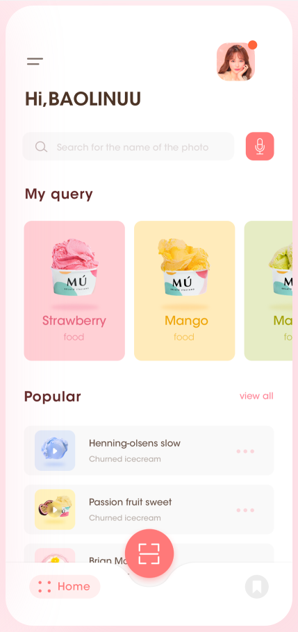

# 005 -  Basic Layouts

Một view dù phức tại đến mấy thì cũng cấu thành từ những View nhỏ hơn, công việc chính của bạn thì phải sắp xếp & bố cục chúng nó sao cho hài hoà. Và chúng ta sẽ tiếp tục phần cơ bản về bố cục trong **SwiftUI** nhoé.

> Bắt đầu thôi!

## Chuẩn bị

### Lý thuyết

* Containers: HStack, VStack, ZStack
* Custom Containers View
* ScrollView
* Layout Priority
* Layout Protocol

### Môi trường

* Xcode 14
* SwiftUI 4
* Swift 5.7

### Tham khảo

* [Bản chất của Layout trong SwiftUI](https://fxstudio.dev/ban-chat-cua-layout-swiftui-notes-30/#23_Cac_View_dac_biet)
* [Layout Protocol](https://developer.apple.com/documentation/swiftui/layout)
* [Custom Container View](https://www.swiftbysundell.com/tips/creating-custom-swiftui-container-views/)

---

## Bài 1 - Badge Number

### Yêu cầu

* Tạo mới một project SwiftUI.
* Custom button có badge number
* Yêu cầu
	* Custom view cho **Button**
	* Có thể xét **badge number**
	* Giá trị bằng `0` thì ẩn đi
	* Giá trị khác `0` thì xuất hiện
	* Kích thước của **badge** sẽ tự động co giãn theo giá trị của nó

* Vị trí của badge có thể xét được
* Mặc định góc trên-bên trái
* Các vị trí:
	* Top-Left
	* Top-Right
	* Top-Center
	* Center-Left
	* Center- Right
	* Bottom-Left
	* Bottom-Center
	* Bottom-Right

### Mô tả

## Bài 2 - Canh đều các ô vuông

### Yêu cầu

* Tạo mới một màn hình cho từng yêu cầu bài tập với các ô vuông.
* Số lượng mỗi ô vuông cho từng bài tập con là **từ 1 đến 3**

* Yêu cầu cho mỗi bài tập con:
	* Ban đầu ô vuông sẽ ở chính giữa màng hình
	* Nếu từ 2 ô trở lên thì chúng sẽ canh đều nhau và ở giữa màn hình
	* Khi xoay ngang/dọc màn hình thì các ô vuông vẫn ở chính giữa màn hình (việc thay đổi size của màn hình không ảnh hưởng tới chúng)
	* Khoảng cách giữa các ô vuông sẽ thay đổi để phù hợp theo size màn hình thay đổi

* Số lượng bài cần làm hơi nhiều nên chịu khó tạo nhiều file cho nhiều bài tập con nhoé

### Mô tả

## Bài 3 - Thay đổi kích thước View

### Yêu cầu

* Tạo giao diện màn hình theo như hình vẽ
* Khi thay đổi kích thước màn hình thì bố cục các View con ở trong vẫn đảm bảo về
	* Tỉ lệ kích thước
	* Tỉ lệ khoảng cách
* Áp dụng cho các trường hợp xoay ngang/dọc

### Mô tả

## Bài 4 - Bố cục thay đổi theo tương tác

### Yêu cầu

* Tạo giao diện như hình vẽ

* Yêu cầu
	* Kích thước hình vuông to gấp đôi hình vuông nhỏ
	* Các hình vuông ở chính giữa màn hình
	* Khoảng cách giữa các hình vuông và 2 cạnh màn hình bằng nhau và bằng 15px
	* Thao tác khi kích vào hình vuông nhỏ
		* Hình vuông đó sẽ phóng to lên gấp đôi
		* Hình vuông to sẽ thu nhỏ lại một nữa
	* Thao tác khi kích vào hình vuông to thì ko có gì xảy ra
	* Có animation cho việc phóng to và thu nhỏ
	* Khoảng cách giữa các hình vuông và 2 mép màn hình không thay đổi

> Bài tập này có thể bỏ qua phần animation vì hơi khó. Nhưng cố gắng làm luôn hỉ!

### Mô tả

## Bài 5 - Stacks View

### Yêu cầu

* Tạo giao diện như hình vẽ
* Sử dụng & kết hợp các Stacks để bố cục giao diện
* Vẫn đảm bảo bố cục với nhiều kích thước khác nhau cho màn hình

### Mô tả

Dọc

Ngang

## Bài 6 - ScrollView

### Yêu cầu

* Tạo giao diện như hình vẽ
* Sử dụng ScrollView vào màn hình có size lớn & nhiều content
* Scroll ngang & dọc trong cùng 1 màn hình cho từng sections khác nhau.

> Nói chung dùng mọi kỹ năng hiện có để làm cho đẹp nhoé.

### Mô tả

## Bài 7 - Profile Screen

### Yêu cầu

* Tạo mới môt màn hình làm Profile cho User
* Sử dụng các bố cục cơ bản để thiết kế
* Về giao diện
	* Có thể tham khảo nhiều thiết kế trên mạng
	* Phải có nội dung dài để áp dụng Scroll vào
	* Canh đều và bố cục các phần thông tin
	* Tạo các thuộc tính cho class để có thể thay đổi thông tin từ bên ngoài

### Mô tả

*(Tham khảo)*

---

*( Vui lòng sử dụng tài liệu trong repo này với mục đích học tập. Nghiêm cấm việc sử dụng hay lợi dụng cho các mục đích thương mai. Vì một cộng đồng SwiftUI phát triễn vững mạnh. Cảm ơn bạn đã quan tâm tới.)*