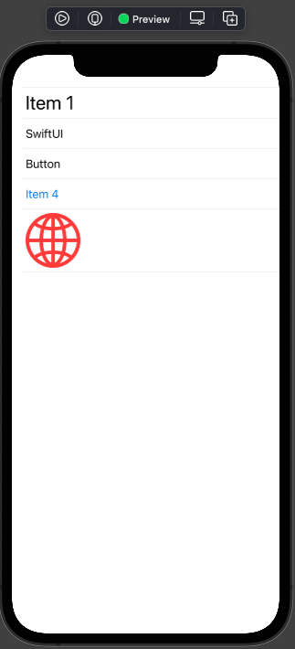
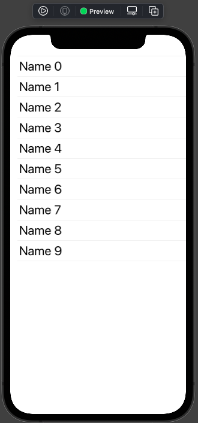
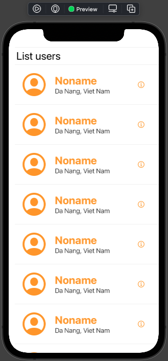
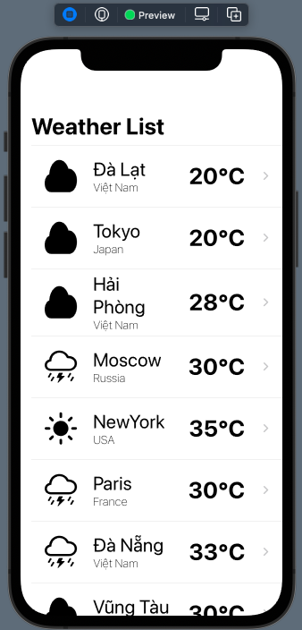
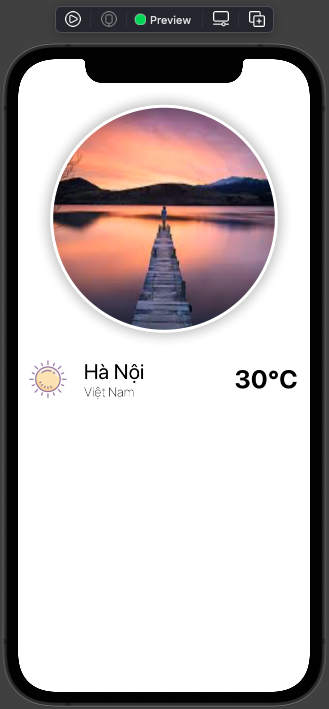
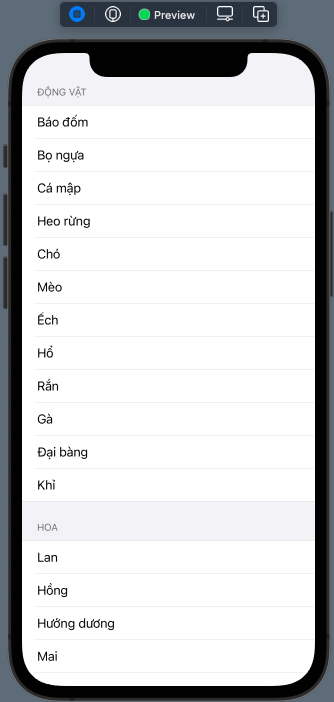
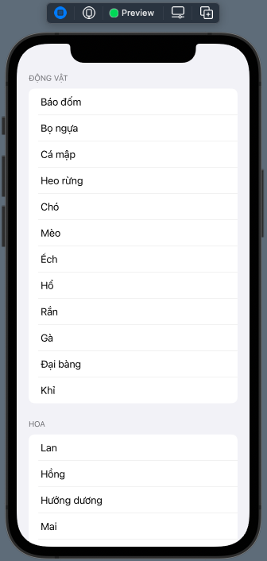
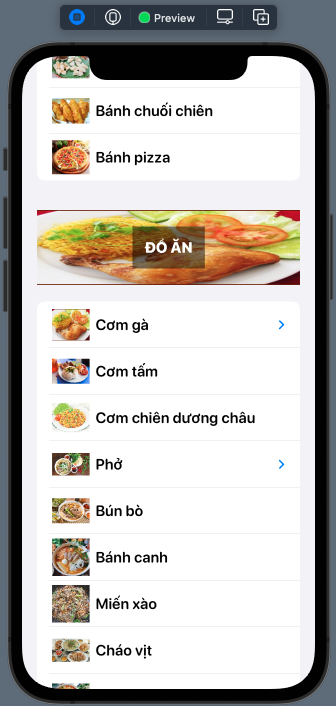
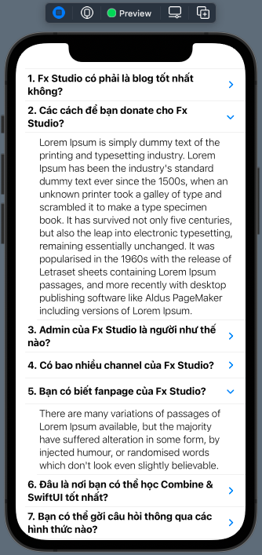
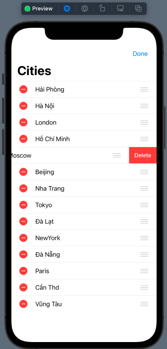

# Working with List

Khi làm việc với ứng dụng di động, thì loại giao diện hiển thị danh sách khá là phổ biết. Ta hay được biết tới bằng cái tên là List, TableView ... Và với SwiftUI cũng tương tự như vậy. Làm chủ được List & các dạng của nó thì xem như bạn đã làm chủ được SwiftUI rồi.

> Bắt đầu thôi!

## Chuẩn bị

### Lý thuyết

* List & Custom Row
* Identifiable Protocol
* Header/Footer View
* Custom Header/Footer View
* Expandable List
* Editing Mode & Edit Button
* Basic Actions (delete, move, insert, move, swipe)

### Môi trường

* Xcode 14
* SwiftUI 4
* Swift 5.7

### Tham khảo

* [Working with List](https://fxstudio.dev/swiftui-phan-8-working-with-list/)

## Bài 1 - Simple List

### Yêu cầu

* Tạo mới một project để code & sử dụng cho toàn bộ các bài tập phần này
* Sử dụng UI Control List

* 3 yêu cầu con cho 3 view List
	* Hiển thị List với các Row là các View khác nhau (image, button, icon, text ....)
	* Hiện thị các Row giống nhau, nhưng nội dung khác nhau. Ví dụ: Lable có text là `Username 1`, `Username 2` ... `Username n`
	* Custom Row cơ bản nhất

* Kết hợp với ForEach để lặp hiển thị 1 danh sách làm dữ liệu cho List

* Thiết kế cho đẹp & khác ví dụ anh để dưới nhóe

### Mô tả

* Static Rows

* Loop Items

* Custom Rows

## Bài 2 - Dynamic List

### Yêu cầu

* Sử dụng lại project trên và tạo thêm một màn hình mới
* Thực hiện mô hình Master - Detail
	* Master : List View
	* Detail : Custom View và sử dụng thông tin từ master
	
* Hiện thị List với dữ liệu từ 1 Array
* Array với kiểu dữ liệu các phần tử là Class
* Tạo Class với Identifiable (tự index trong list)

### Mô tả

> Tham khảo giao diện thôi nhóe. Hãy làm cho đẹp và khác nha.

* Master

* Detail

## Bài 3 - Sections & Groups

### Yêu cầu

* Tạo mới một màn hình
* Sử dụng Section để hiển thị nhiều danh sách
* Custom Header/Footer của Section
* Tùy chọn stype cho các Row trong Section (GroupedList hoặc InsetGrouped)

### Mô tả

> Tham khảo giao diện thôi nhóe. Hãy làm cho đẹp và khác nha.

## Bài 4 - Expandable List

### Yêu cầu

* Tạo mới 1 màn hình để hiện thị danh sách nhiều chiều & có thể đóng mở xịn sò
* Hiển thị Expandable List với nhiều cấp (2 cấp & 3 cấp)
* Cấp trúc lại các array cho phù hợp với Expandable List
* Custom Header trong Expandable List

### Mô tả

> Thử làm với List hiển thị cây thư mục & files nha!

## Bài 5 - Disclosure Group

### Yêu cầu

* Màn hình
 * Tạo một màn hình với 1 Button. Khi kích vào Button sẽ present màn hình Q&A.
 * Tạo một màn hình Q&A, có 1 List hiển thị các câu hỏi & câu trả lời. 1 Button để dismis màn hình lại

* Dữ liệu xây dựng với nhiều câu hỏi & câu trả lời có nội dung dài ngắn khác nhau.
* Kích vào mỗi câu thì hiển thị ra câu trả lời
* Giao diện có chiều cao của các Row phù hợp theo độ dài của câu hỏi và trả lời.
* Lưu lại trạng thái câu hỏi nào được mở hay đóng, để lần sau mở app thì hiển thị lại đúng như vậy

### Mô tả

## Bài 6 - Editing Mode

### Yêu cầu

* Tạo mới một màn với List và Custom Row cơ bản
* Kích hoạt trạng thái Editing Mode bằng 2 cách
	* Edit Button
	* Editing Mode
* Thực hiện các actions cơ bản trên Row
	* Delete
	* Move
	* Insert
* Thực hiện 2 kiểu selection cho các Row
	* Single
	* Multipe

* Nếu thấy khó gom tất cả yêu cầu vào cùng một màn hình thì có thể tách ra nhiều màn hình nhóe

### Mô tả

---

*( Vui lòng sử dụng tài liệu trong repo này với mục đích học tập. Nghiêm cấm việc sử dụng hay lợi dụng cho các mục đích thương mai. Vì một cộng đồng SwiftUI phát triễn vững mạnh. Cảm ơn bạn đã quan tâm tới.)*