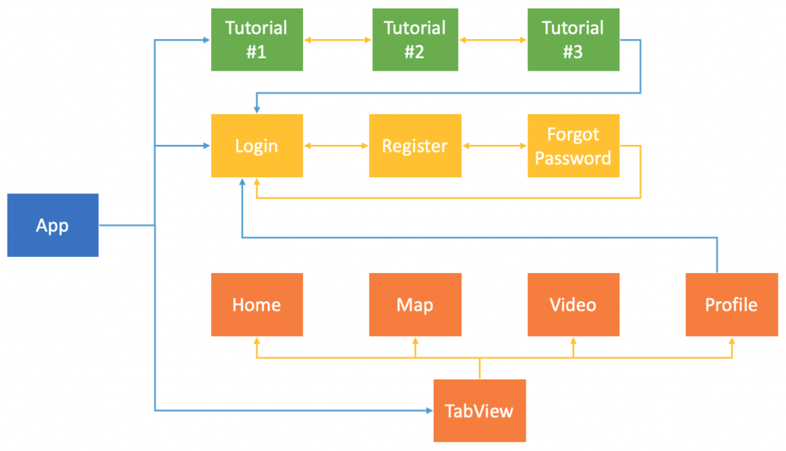

# Routing

Khi bạn phát triển một ứng dụng mobile với nhiều màn hình hiển thị, thì việc xác đinh các luồng di chuyền giữa các màn hình là điều khá quan trọng. Việc này còn giúp bạn xác định được các luồng chính trong ứng dụng. Từ đó, việc quản lý dữ liệu & hiển thị sẽ dễ dàng hơn. Công việc này được dân gian lập trình gọi là **Routing**. Với **SwiftUI**, bạn sẽ khá là bỡ ngỡ với chúng, lúc này mọi thứ đều thay đổi hết rồi.

> Bắt đầu thôi

## Chuẩn bị

### Lý thuyết

* NavigationView
* NavigationLink
* Modal View, Alert & ActionSheet
* TabView & PageView
* Custom TabBar
* SideBar & Toolbar
* Change Root & Screen Flow

### Môi trường

* Xcode 14
* SwiftUI 4
* Swift 5.7

### Tham khảo

* [Routing in SwiftUI](https://fxstudio.dev/swiftui-phan-9-routing-in-swiftui/)

## Bài 1 - Login Flow

### Yêu cầu

* Tạo một project mới, với các màn hình như sau:
	* Login Screen
	* Register Screen
	* Forgot Password Screen

* Sử dụng Navigation để tiền hành cài đặt việc di chuyển giữa các luồng màn hình trong Login Flow.
* Cụ thể:

```
// Chiều đi
Login > Register
Login > Forgot Password
Login > Register > Forgot Password

// Chiều về
Login > Register > Login
Login > Forgot Password > Login

Login > Register > Forgot Password > Login
Login > Register > Forgot Password > Register
```

* Xử lý thêm về mặt UI của mỗi màn hình:
	* Custom Style
	* Button
	* Validate
	* Image Picker để chọn ảnh làm avatar (nếu có)
	* Date Picker để chọn ngày sinh (nếu có)

* Custom cơ bản cho Navigation Bar (nếu có sử dụng)

### Mô tả

* Login Screen


* Register Screen


* ForgotPassword Screen


## Bài 2 - TabView

### Yêu cầu

* Tạo một màn hình mới sử dụng TabView (tương tự như UITabbar của UIKit)
* Mỗi View của mỗi Tab đều có 4 button để mở 4 tab tương ứng
* Thực hiện thay đổi Tab hiển thị khi nhấn vào Button tương ứng trong mỗi View của mỗi Tab

### Mô tả


## Bài 3 - Custom Tabbar

### Yêu cầu

* Tạo một màn hình mới
* Sử dụng hết kiến thức để Custom Tabbar, tương tự như UITabbarController ở UIKit
* Bài tập nâng cấp của bài 2
* Chức năng
	* Kích vào mỗi tab thì sẽ đổi View tương ứng
	* Tại mỗi View thì có thể kích vào các Button để mở các tab khác
	* Với Action Button (chính giữa) thì sẽ present một View mới lên

### Mô tả


## Bài 4 - Change Root

### Yêu cầu

* Kết hợp các màn hình đã tạo ở các bài trước để tạo thành flow của ứng dụng:
	* Tutorial Flow
	* Login Flow (Login, Register & Forgot)
	* Tabbar Flow với 4 flow con. Sử dụng Navigation cho các flow con
* Áp dụng State & Data Flow vào ứng dụng để lưu trạng thái ứng dụng

* Về các màn hình
	* Có thể copy lại các màn hình trước đó
	* Hoàn thiện về mặt thiết kế để chúng được đồng nhất về style
	* Xem như là làm trước UI cho final project

### Mô tả



---

*( Vui lòng sử dụng tài liệu trong repo này với mục đích học tập. Nghiêm cấm việc sử dụng hay lợi dụng cho các mục đích thương mai. Vì một cộng đồng SwiftUI phát triễn vững mạnh. Cảm ơn bạn đã quan tâm tới.)*