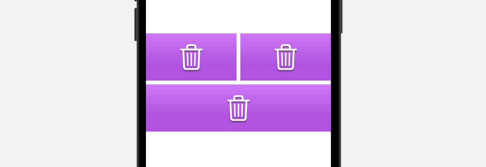

# Grid Layout

Với các ứng dụng mobile, chúng ta có thể một dạng hiển thị danh sách theo kiểu ô lưới, tương tự như *Collection* View ở *UIKit*. Nó gọi tên chung là **Grid** hay **Grid Layout**. Phần này, các bạn sẽ tiếp tục rèn luyện thêm về mặt UI với **Grid Layout** nhóe. Sẽ có rất nhiều thay đổi so với *iOS*, do đó hay tìm kiếm và tham khảo thêm nhiều nguồn khác nhau.

> Bắt đầu thôi!

## Chuẩn bị

### Lý thuyết

* Grid với VStack & HStack
* Grid & Grid Row
* LazyVGrid & LazyHGrid
* GridItem & Configuring Layout
* Sections & Custom
* Switching Grid Layouts
* Combine Grid Layouts

### Môi trường

* Xcode 14
* SwiftUI 4
* Swift 5.7

### Tham khảo

* [Git Layout](https://fxstudio.dev/swiftui-phan-10-grid-layout/)

## Bài 1 - Grid với VStack & HStack

### Yêu cầu

* Tạo mới một project cho phần bài tập này
* Sử dụng các Stack Container cơ bản là VStack & HStack
* Hãy custom các Cell cho đẹp
* Dữ liệu được lưu ở một Array và hay tạo class/struct cho các item trong Array đó
* Lặp dữ liệu và hiển thị chúng dưới dạng ô lưới, bằng cách kết hợp các VStack & HStack
* Khi nhấn vào các Cell
	* Cell mới nhấn vào sẽ đổi màu
	* Cell đã đổi màu thì sẽ reset về màu đầu tiên

### Mô tả

## Bài 2 - Grid & Grid Row

### Yêu cầu

* Tạo mới các màn hình để áp dụng cho các yêu cầu con trong bài tập này
* Sử dụng API mới của SwiftUI 4.0 là Grid & GridRow
* Kết hợp với nhau để tạo ra các bài giao diện như mô tả

### Mô tả

* Yêu cầu 1

* Yêu cầu 2

* Yêu cầu 3

## Bài 3 - LazyVGrid & LazyHGrid

### Yêu cầu

* Tạo mới các màn hình để áp dụng cho các yêu cầu con trong bài tập này
* Sử dụng 2 GridLayout chính đó là: LazyVGrid & LazyHGrid
* Chuẩn bị dữ liệu (struct/class & array)
* Lặp để hiện thị các phần tử lên Grid
* Custom Row
* Thực hiện các yêu cầu con trong từng màn hình khác nhau 

### Mô tả

* Lazy Grid cơ bản

* Thay đổi kích thước Row

* Spacing

* LazyHGrid (scroll ngang)

## Bài 4 - GridItem & Configuring GridLayout

### Yêu cầu

* Tạo mới các màn hình để áp dụng cho các yêu cầu con trong bài tập này
* Sử dụng thành tạo GridItem trong việc cấu hình giao diện cho Grid
* Tạo các mình hình với các kiểu cấu hình của GridItem

### Mô tả

* Default

* Flexible

* Fixed

* Adaptive

* Mixing

## Bài 5 - Sections

### Yêu cầu

* Tạo mới các màn hình để áp dụng cho các yêu cầu con trong bài tập này
* Tiếp tục hiển thị Grid khi dữ liệu được chia thành nhiều Sections
* Áp dụng chung cho cả LazyVGrid & LazyHGrid
* Chuẩn bị dữ liệu
* Custom Row & Section

### Mô tả

* LazyVGrid

* LazyHGrid

## Bài 6 - Switching Gird Layout

* Tạo một màn hình để thực hiện bài tập này.
* Thay đổi các cấu hình cho Grid Layout của bạn
* Khi nhấn vào Bar Button ở Navigation thì chuyển đổi giao diện lần lượt theo từng cấu hình
* Có hiệu ứng (animation) ở các lần chuyển đổi

### Mô tả

Giao diện sẽ thay đổi lần lượt theo số lượng các Row trong một hàng.

## Bài 7 - Combine Gird

### Yêu cầu

* Tạo một màn hình để thực hiện bài tập này.
* Thật là tuyệt với khi chúng ta kết hợp các kiểu giao diện lại với nhau.
* 1 màn hình có thể có
	* Nhiều List
	* Nhiều Grid
	* Nhiều List & Grid
	* Mỗi khi xoay màn hình sẽ thay đổi giao diện
* Tham khảo các mô tả ở dưới và hãy làm theo lại theo ý tưởng của tụi em. Nhưng phải đảm bảo các yêu câu cơ bản như trên.

### Mô tả

* Các dạng kết hợp khác nhau

* Giao diện thay đổi khi xoay màn hình

---

*( Vui lòng sử dụng tài liệu trong repo này với mục đích học tập. Nghiêm cấm việc sử dụng hay lợi dụng cho các mục đích thương mai. Vì một cộng đồng SwiftUI phát triễn vững mạnh. Cảm ơn bạn đã quan tâm tới.)*