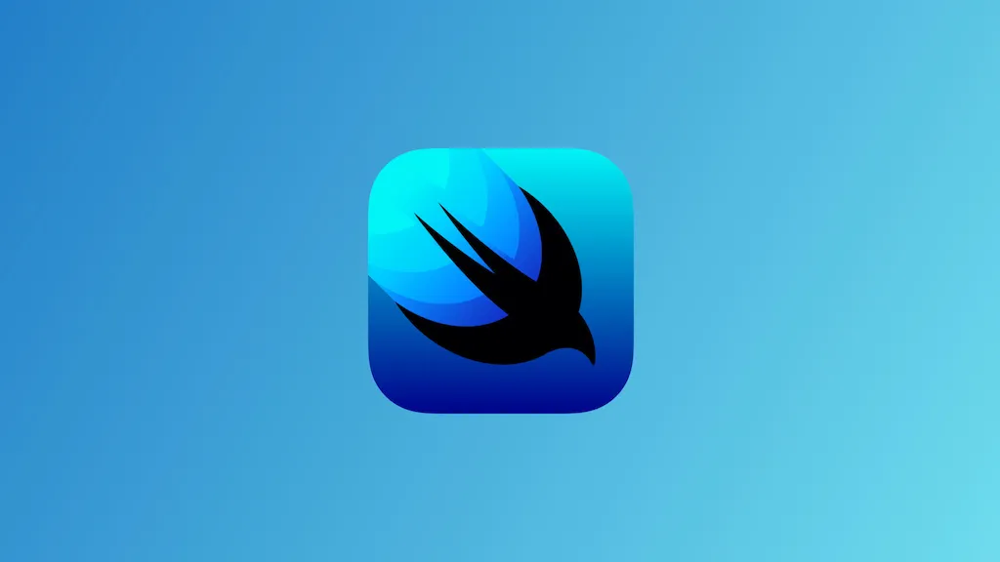

# Training SwiftUI
## Giới thiệu

Chào mừng bạn đến với Repo học SwiftUI này.

Chi tiết về **SwiftUI** thì bạn có thể tự tìm hiểu nhóe. Còn về repo này, đơn giản chỉ là:

> Cơ hội thứ 2 cho bạn mà thôi!

Cơ hội thứ 2 để bắt đầu lại việc học lập trình iOS nói riêng hoặc mobile nói chung. Bạn cần phải thay đổi cách suy nghĩ một chút để hợp SwiftUI hay hợp với xu thế lập trình mới bây giờ. 

Cuối cùng, bạn cũng không cần quá lo lắng. Mình code tới đây thì fix bugs tới đó thôi. EZ!

## Mục tiêu

Mục tiêu của việc training lần này cũng khá là đơn giản. Tóm gọn với 2 ý sau:

* Lập trình ứng dụng iOS với SwiftUI
* Phát triển toàn bộ một project bằng SwiftUI

Về người học, bạn cần có kiến thức **Lập trình iOS cơ bản** là đủ rồi. Tiếp theo, bạn cần có sự kiên trì, tích cực và chủ động tương tác. Cuối cùng, bạn cần có ...

> Một tâm hồn đẹp!

Vì **SwiftUI** chính là *giao diện*, một suy nghĩ trong sáng & một tâm hồn đẹp thì sẽ cho ra sản phẩm đẹp. Mình cần đẹp trước, mượt sau và cuối cùng là ổn định nhóe!

## Hướng dẫn

Về mặt thiết bị và phần mềm sử dụng thì cần cập nhật tất cả lên version mới nhất hiện tại. Cụ thể:

* Xcode 14 (trở lên)
* SwiftUI 4.0
* Swift 5.7

Về mặt traing sẽ tập trung vào việc học thông qua các ví dụ. Cụ thể, bạn sẽ hoàn thành 14 phần bài tập khác nhau. Mỗi phần sẽ có nhiều bài tập nhỏ. Tất cả bài tập được sắp xếp theo lộ trình và có mục đích cụ thể rồi. Do đó, bạn cần tuần thủ 2 điều.

* Làm theo thứ tự các phần bài tập
* Không bỏ bước hoặc đốt cháy giai đoạn

Về mặt code, bạn cần tuân thủ theo hướng dẫn:

1. **Clone** repo về
2. Tạo **branch** riêng cho mỗi phần bài tập. Ví dụ: `tienlp_baitap_01`
3. Tạo thư mục con trong thư mục phần bài tập. Ví dụ: `001 --> TienLP`
4. Trong thư mục con đấy, bạn có thể tải lên các file Swift riêng lẻ hoặc 1 project chung cho các bài tập trong một phần.
5. Cố găng tách từng **comit** cho từng bài tập trong một phần nhóe.
6. Khi hoàn thành, bạn hãy gửi **pull request** để được **review** & chỉnh sửa lại theo các **comments**.

Nếu có vấn đề hay thắc mắc gì thì hãy gửi **issues** nhóe. Và hãy thoải mái & tự tin lên. Hết!

## Danh sách bài tập

1. [Hello SwiftUI](./001)
2. [SwiftUI App](./002)
3. [Views & Modifiers](./003)
4. [Gestures](./004)
5. [Basic Layout](./005)
6. [State & Data Flow](./006)
7. [List](./007)
8. [Routing](./008)
9. [Grid](./009)
10. [API](./010)
11. [Storing Data](./011)
12. [Map](./012)
13. [Media](./013)
14. [Final Project](./014)

## Tham khảo

* Website: [fxstudio.dev](https://fxstudio.dev/)
* [SwiftUI Series](https://fxstudio.dev/category/code/swiftui/) (Fx Studio)
* [SwiftUI Tutorial](https://developer.apple.com/tutorials/swiftui) (Apple Developer)
* *Và nhiều trang web khác ... sẽ được bổ sung sau*

---

*( Vui lòng sử dụng tài liệu trong repo này với mục đích học tập. Nghiêm cấm việc sử dụng hay lợi dụng cho các mục đích thương mai. Vì một cộng đồng SwiftUI phát triễn vững mạnh. Cảm ơn bạn đã quan tâm tới.)*